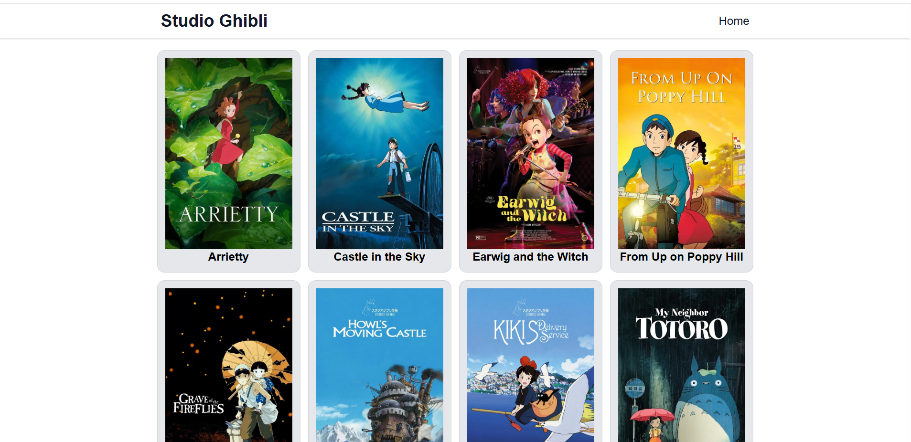
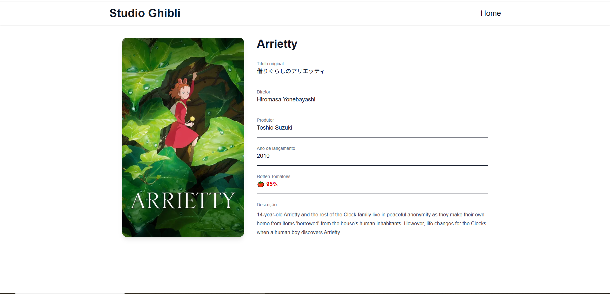

# 🎬 Studio Ghibli Films

A React and TypeScript application that consumes the public Studio Ghibli API.

The application displays the first 10 Studio Ghibli films in alphabetical order and allows users to view detailed information about each movie.

---

## 📸 Preview

> Add screenshots or a GIF of your application here.

```md



```

---

## ✨ Features

- Display the first 10 Studio Ghibli films
- Sort movies alphabetically
- View detailed information for each movie
- Client-side routing with React Router
- Loading and error handling
- Responsive interface
- Data fetching and caching with React Query
- Fully typed with TypeScript

---

## 📄 Movie Details

### Home Page

- Movie poster
- Movie title

### Details Page

- Title
- Original title
- Director
- Producer
- Release year
- Rotten Tomatoes score
- Description

---

## 🚀 Technologies

- React
- TypeScript
- Vite
- React Router DOM
- TanStack React Query
- Tailwind CSS

---

## 🌐 API

This project uses the public Studio Ghibli API:

```text
https://ghibliapi.vercel.app/films
```

---

## 📁 Project Structure

```text
src
├── components
│   ├── Header
│   └── Layout
│
├── hooks
│   └── useFilms.tsx
│
├── pages
│   ├── Home
│   └── FilmDetail
│
├── routes
│   └── index.tsx
│
├── styles
│   └── global.css
│
├── types
│   └── types.ts
│
├── App.tsx
└── main.tsx
```

---

## ▶️ Getting Started

Clone the repository

```bash
git clone https://github.com/YOUR_USERNAME/YOUR_REPOSITORY.git
```

Navigate to the project folder

```bash
cd YOUR_REPOSITORY
```

Install dependencies

```bash
npm install
```

Run the development server

```bash
npm run dev
```

Open your browser and visit

```text
http://localhost:5173
```

---

## 🛣️ Routes

| Route | Description |
|-------|-------------|
| `/` | Displays the list of movies |
| `/films/:id` | Displays movie details |

---

## 📚 Concepts Practiced

- REST API consumption
- React Query
- React Router
- Component-based architecture
- Custom Hooks
- TypeScript
- Data typing
- Array sorting with `sort()`
- Finding items with `find()`
- Conditional rendering
- Loading and error handling
- Responsive UI development

---

## 👨‍💻 Author

Developed by **Israel Monteiro**

GitHub: https://github.com/israel-monteiro